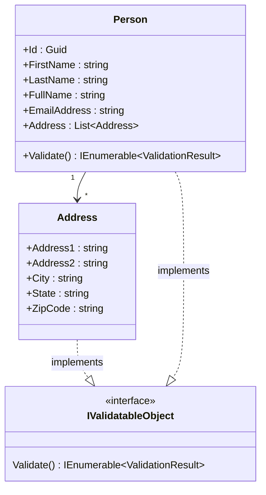
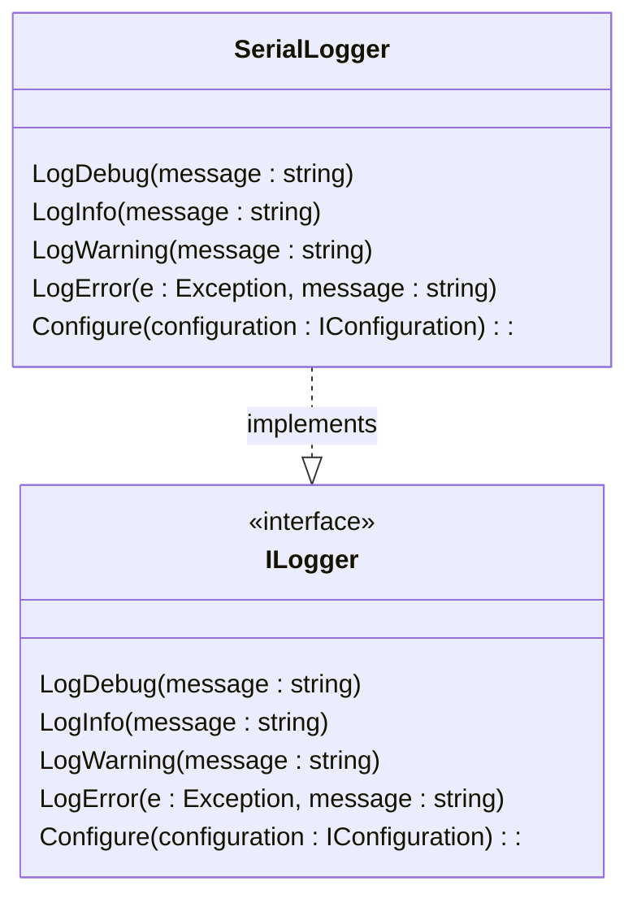

# 02 - Introduction to Object-oriented Design

## The 4 Pillars of Object-oriented Design
Abstraction, Encapsulation, Inheritance, Polymorphism

## Abstraction
- Abstraction is the concept of hiding the complex implementation details and showing only the necessary features of the object.
- Implementation Hiding
- "It's none of your business how other classes work internally."

## Encapsulation
- Encapsulation is the concept of restricting direct access to some of the object's components.
- Data Hiding
- "You don't need to know what other classes know; if they want your help they'll ask."

## Inheritance
- Inheritance is the concept of a class inheriting properties and behavior from another class.
- Object Taxonomy (a family tree of classes)
- "A dog is a mammal, a lizard is a reptile; both are animals."

## Polymorphism
- Polymorphism is the concept of an object behaving in multiple forms.
- Object Interchangeability
- "A method can take an animal object, and it can be a dog, or a lizard."

# The SOLID Principles
Single Responsibility Principle, Open/Closed Principle, Liskov Substitution Principle, Interface Segregation Principle, Dependency Inversion Principle

## Single Responsibility Principle
- A module should have a well-defined responsibility.

## Open/Closed Principle
- A module should be open for extension but closed for modification.

## Liskov Substitution Principle
- Objects of a superclass should be replaceable with objects of its subclasses without affecting the functionality of the program.
- Essentially polymorphism.

## Interface Segregation Principle
- A client should not be forced to implement an interface that it doesn't use.

## Dependency Inversion Principle
- High-level modules should not depend on low-level modules. Both should depend on abstractions.
- "Don't tie yourself to specific implementations; use interfaces."

# Other OO Vocabulary
Cohesion, Coupling, Orthogonality

## Cohesion
- Cohesion is the degree to which the elements inside a module belong together.
- Descibes 'at that level' how well the elements of a module fit together.

## Coupling
- Coupling is the degree to which one module relies on another module.
- Classes which are tightly coupled are difficult to maintain.  The more ties there are between classes, the stronger that tie becomes.
- Changes in dependencies can have a ripple effect and require changes in consuming classes.
- "Tightly coupled code" is considered brittle and difficult to maintain.
- "Loosely coupled code" is considered more flexible and easier to maintain."

# Nouns and Verbs (and sometimes Adjectives)

## Nouns = Classes
Includes entities such as Customer, Order, and Product.  Also includes non-entity objects like loggers, controllers, and messages
- Customer - The users of the system
- Order - A heading for collections of purchased items
- Shipment - Tracking details for sending orders to clients
- Supplier - Manufacturer or reseller of items available to clients
- Logger - Behind-the-scenes record of system events

## Verbs = Methods
The things your classes can do, both to themselves and to other objects
- Ship - Send an order to a client
- Cancel - Stop an order from further processing
- Complete - Mark an order as successfully finished
- CalculateTotal - Determine the total cost of an order

## Adjectives = Interfaces
Abstract capabilities that an object has, compoised of its methods and properties combined
- IValidatable - Object can be validated
- ISerializable - Object can be transported or stored
- IEnumerable - Represents a collection of items that can be iterated
- IDisposable - Object is responsible for cleaning up after itself