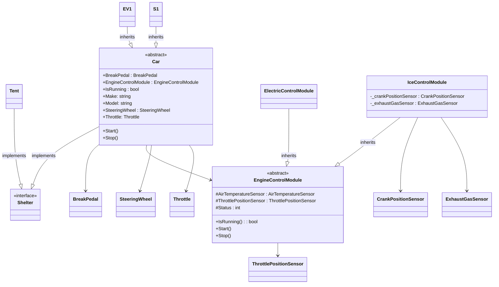

# 03 - The Four Pillars

Example diagrams for module 3 - The Four Pillars

## Class Diagram

## Summary
- Abstraction; hide complexity
- Encapsulation; hide or move supporting data
- Inheritance; extract commonalities
- Polymorphism; objects can have multiple roles and multiple objects can have the same role