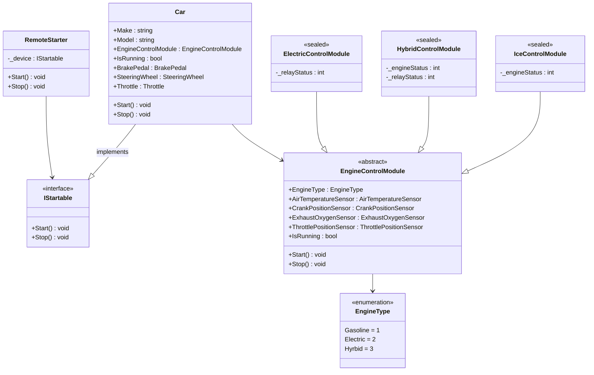

# 04 - The SOLID Principles

The 4 pillars can tell you what's possible, but can be obtuse when it comes to how to actually implement them.
The SOLID principles are a set of guidelines that help you to write code that is easier to maintain, extend, and test.

## Single Responsibility Principle

1. **BEST: A module should have a well-defined responsibility.**
1. A class should have one, and only one, reason to change, OR...
1. There should never be more than one reason for a class to change.

## Open/Closed Principle

1. **BEST: You should be able to extend a class's behavior, without modifying it.**
1. Software entities (classes, modules, functions, etc) should be open for extension, but closed for modification.

## Liskov Substitution Principle

1. **BEST: Derived types must be substitutable for their base types.**
1. At its core, this principle is just Polymorphism!

## Interface Segragation Principle

1. Clients should not be forced to depend upon interface that they do not use, OR...
1. Make fine-grained interfaces that are client-specific.

## Dependency Inversion Principle

1. High-level modules should not depend on low-level modules. BOTH should depend on abstractions, OR...
1. Depend on abstractions, not concretions. Therefore:
   1. Don't depend on specific classes
   1. Don't instantiate your own dependencies
   1. Prefer dependencies as interfaces --> provided from an outside source

## Class Diagram

