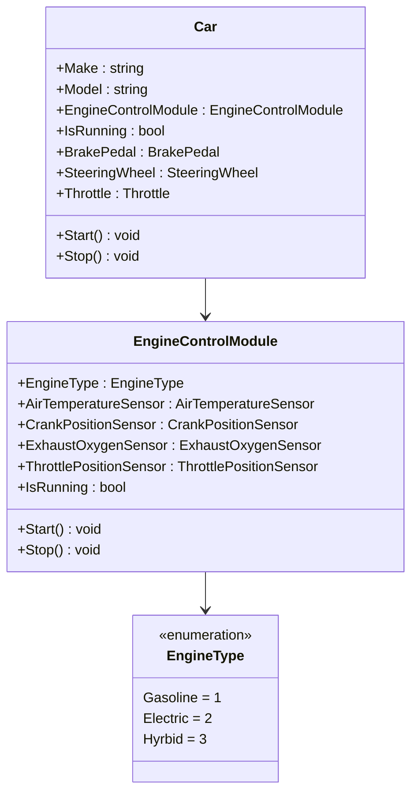

# 04 - The SOLID Principles
The 4 pillars can tell you what's possible, but can be obtuse when it comes to how to actually implement them.
The SOLID principles are a set of guidelines that help you to write code that is easier to maintain, extend, and test.

## Single Responsibility Principle
1. **BEST: A module should have a well-defined responsibility.**
1. A class should have one, and only one, reason to change, OR...
1. There should never be more than one reason for a class to change.

## Open/Closed Principle
1. **BEST: You should be able to extend a class's behavior, without modifying it.**
1. Software entities (classes, modules, functions, etc) should be open for extension, but closed for modification.

## Class Diagram

